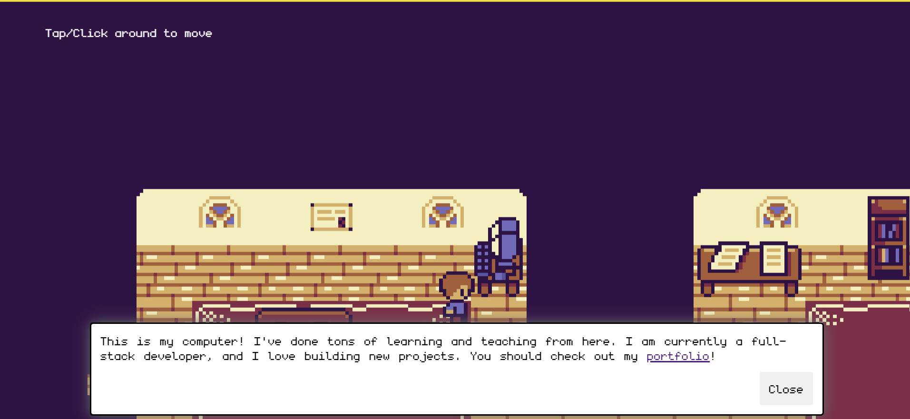

# 2D Game Portfolio
Click around or use arrow keys to move. Bump into objects. Get to me know and see some of my work!

**Link to project:** https://sav-2d-portfolio.netlify.app/

## How It's Made:

**Tech used:** HTML, JavaScript, Kaboom, Vite

This project was a blast to work on. I loved the idea of using a game as a portfolio because it's the perfect way to showcase who you are as a human--personal and professional!

This was made following the fabulous tutorial by JSLegend that can be found [here](https://www.youtube.com/watch?v=gwtfWORCN0U). 

## Lessons Learned:

I love following tutorials to see how different developers would write code, organize the file structure, etc. This was a really fun way to dip my toes into game-building, and I'm definitely interested in doing more. 
